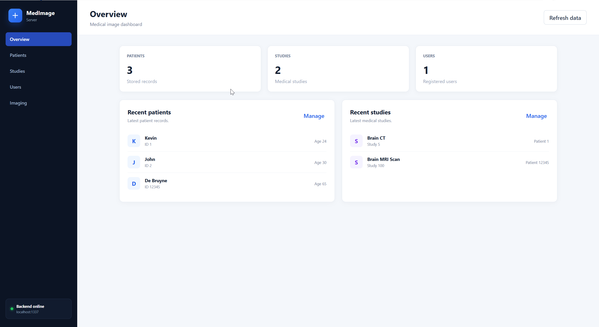
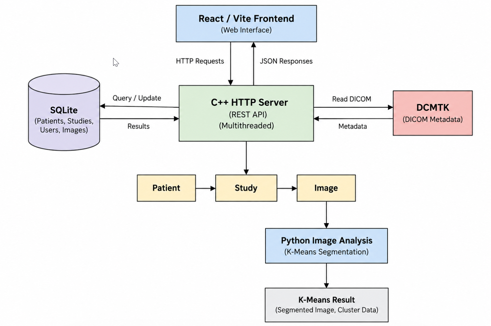
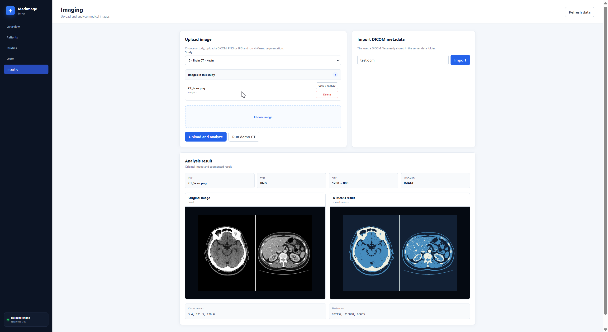

# Secure Medical Image Server

A full-stack project for storing, managing and analysing medical images.

The backend is written in C++ and provides a multithreaded HTTP server with a REST API and SQLite database. Patients, studies and uploaded images are linked together in the database. The project also supports DICOM metadata, a React frontend and basic image segmentation using K-Means.

The image analysis is included as a demonstration of image processing and is not intended for medical diagnosis.

## Preview

<p align="center">
  
</p>

<p align="center">
  <em>Web dashboard for managing patients, studies, users and medical images.</em>
</p>

## Features

### Backend

- C++17 HTTP/TCP server
- Multithreaded client handling
- REST API
- SQLite database
- Patient, study and user CRUD operations
- Study-linked image storage
- API key authentication
- Input validation
- File upload handling
- DICOM metadata parsing with DCMTK

### Medical images

- Upload PNG, JPG, JPEG and DICOM files
- Link uploaded images to studies
- List images belonging to a study
- Re-open and analyse previously uploaded images
- Delete stored images
- Import patient and study information from DICOM metadata

### Image analysis

- Python-based image processing
- DICOM loading with pydicom
- PNG and JPEG loading with Pillow
- Grayscale image processing
- K-Means segmentation with three intensity clusters
- Original and segmented image previews
- Cluster centers and pixel counts

### Web interface

- React frontend
- Vite development server
- Patient management
- Study management
- User management
- Medical image upload
- Image analysis view
- DICOM metadata import
- Backend connection status

## Architecture

The React frontend communicates with the C++ server through HTTP requests. The server handles database operations, DICOM metadata and image requests, while image analysis is performed by the Python processing pipeline.

<p align="center">
  
</p>

SQLite stores the patient, study, user and image records. Uploaded image files are stored on disk, while their paths and study relationships are stored in the database.

## Technologies

### Backend

- C++17
- CMake
- SQLite
- DCMTK
- POSIX sockets

### Image processing

- Python
- pydicom
- NumPy
- Pillow
- scikit-learn

### Frontend

- React
- Vite
- JavaScript
- CSS

### Development and testing

- GoogleTest
- CTest
- Docker
- Git
- GitHub
- GitHub Actions
- Linux / WSL

## Quick Start

The easiest way to run the backend is with Docker.

### 1. Build the Docker image

Run this from the project root:

```bash
docker build -t medical-server .
```

### 2. Start the backend

```bash
docker run --rm \
  -p 1337:1337 \
  -e MEDICAL_API_KEY=test123 \
  medical-server
```

The backend will be available on:

```text
http://localhost:1337
```

`--rm` removes the container automatically after it is stopped.

Stop the server with:

```text
Ctrl+C
```

### 3. Start the frontend

Open another terminal:

```bash
cd frontend
npm install
npm run dev
```

Then open:

```text
http://localhost:5173
```

During development, Vite forwards `/api` requests to the C++ server on port `1337`.

The frontend currently uses `test123` as the development API key, so the backend should be started with the same value.

## Docker with Persistent Data

By default, data created inside the container is removed with the container.

To keep the SQLite database and uploaded images between runs, mount the local `data` directory:

```bash
docker run --rm \
  -p 1337:1337 \
  -e MEDICAL_API_KEY=test123 \
  -v "$(pwd)/data:/app/data" \
  medical-server
```

The database and uploaded files will then remain in the project's local `data/` directory.

## Native Build

The backend can also be built and run directly without Docker.

### Requirements

A Linux environment with:

- C++17 compiler
- CMake
- SQLite development libraries
- DCMTK
- Python 3
- Python virtual environment support

Create a Python virtual environment:

```bash
python3 -m venv .venv
```

Install the Python dependencies:

```bash
.venv/bin/pip install -r requirements.txt
```

Configure the C++ project:

```bash
cmake -S . -B build
```

Build it:

```bash
cmake --build build
```

Set the API key:

```bash
export MEDICAL_API_KEY=test123
```

Start the server:

```bash
./build/med
```

The server listens on port `1337`.

## API

Protected endpoints require the API key header:

```text
X-API-Key: test123
```

The frontend sends this automatically during local development.

| Method | Endpoint | Description |
|---|---|---|
| GET | `/patients` | Get all patients |
| POST | `/patients` | Add a patient |
| PUT | `/patients` | Update a patient |
| DELETE | `/patients` | Delete a patient |
| GET | `/studies` | Get all studies |
| POST | `/studies` | Add a study |
| PUT | `/studies` | Update a study |
| DELETE | `/studies` | Delete a study |
| GET | `/users` | Get all users |
| POST | `/users` | Add a user |
| PUT | `/users` | Update a user |
| DELETE | `/users` | Delete a user |
| GET | `/images?study_id=<id>` | Get images belonging to a study |
| DELETE | `/images` | Delete an image |
| POST | `/dicom` | Import DICOM metadata |
| POST | `/analyze-image` | Upload and analyse an image |
| POST | `/analyze-existing-image` | Analyse an existing uploaded image |
| GET | `/analysis` | Run the built-in CT analysis demo |

Example:

```bash
curl \
  -H "X-API-Key: test123" \
  http://localhost:1337/patients
```

## DICOM Support

DCMTK is used by the C++ backend to read DICOM metadata.

A DICOM file placed inside the `data` directory can be imported through the API:

```bash
curl \
  -X POST \
  -H "X-API-Key: test123" \
  --data "test.dcm" \
  http://localhost:1337/dicom
```

The server reads:

- Patient ID
- Patient name
- Patient age
- Study ID
- Study description
- Modality

The repository contains `data/test.dcm`, which is a small metadata-only DICOM file used for testing.

It can be regenerated with:

```bash
.venv/bin/python python/create_test_dicom.py
```

Since this test file does not contain pixel data, it is used for testing metadata import rather than image analysis.

DICOM files that contain `PixelData` can also be uploaded and processed by the image analysis pipeline.

## Image Analysis

Images can be uploaded and analysed from the web interface.

The current implementation converts the image to grayscale and uses K-Means clustering to group the pixels into three intensity clusters.

<p align="center">
  
</p>

<p align="center">
  <em>Original image and K-Means segmentation result shown in the web interface.</em>
</p>

An example result could contain:

```text
Cluster centers
3.4, 121.3, 238.0
```

These values are the average grayscale intensities of the three clusters, ordered from darkest to brightest.

The analysis also returns the number of pixels in each cluster and generates previews of both the original image and the segmented result.

K-Means is used as an unsupervised image segmentation example. It does not identify diseases or make medical predictions.

## Tests

Build the project first:

```bash
cmake --build build
```

Run the C++ tests with:

```bash
ctest --test-dir build --output-on-failure
```

The test suite covers core functionality including patients, users, studies, database operations and DICOM metadata handling.

The frontend can be checked with:

```bash
cd frontend
npm run lint
npm run build
```

## Security

The backend reads its API key from the `MEDICAL_API_KEY` environment variable.

Requests without the correct API key are rejected.

The current authentication system is intended for development and demonstration. The project does not currently provide individual user login, sessions or role-based authorization and should not be used with real patient data.

## Development Tools

Tools used during development include:

- Visual Studio Code
- Git and GitHub
- CMake
- Docker
- GitHub Actions
- Linux / WSL

AI tools were used as development aids during the project.

## Roadmap

See [`ROADMAP.md`](ROADMAP.md) for completed phases and planned improvements.
